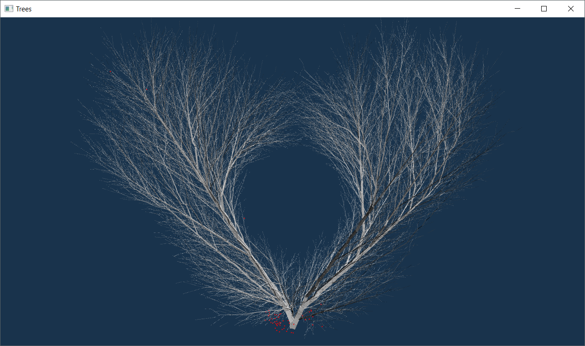

# Trees

This project grows trees into clouds of attractor points to help model trees procedurally!

Here are a few videos hosted on Vimeo that showcase some more examples:  
[Tree growth](https://vimeo.com/299150076)  
[Growing a tree into a 3D model of my friend's head](https://vimeo.com/299150458)  

This is a sequence of images describing the algorithm:  

First, we place attractor points within a bounding mesh. Here's a helix for example:

Then, we iteratively grow the tree. In the gif below, I clicked the "Iterate Tree" Button, which will run the space colonization algorithm
for the indicated 25 iterations.

Here's a previous iteration of the project where I grew tree branches into a heart shape:

# Credits / Resources
* [LearnOpenGL](https://learnopengl.com/) for base code setup guidance.
* [GLAD](https://github.com/Dav1dde/glad) for GL Loading/Generating based on official specs.
* [GLFW](http://www.glfw.org/download.html) for simple OpenGL Context and window creation.
* [GLM](https://glm.g-truc.net/0.9.8/index.html) for linear algebra library.
* [TinyObjLoader](https://github.com/syoyo/tinyobjloader) for header-only, fast OBJ Loading.
* [PCG32](http://www.pcg-random.org/) for header-only, seeded random number generation.
* [Imgui](https://github.com/ocornut/imgui) for easy and awesome UI.
* [UPenn Course CIS 460](https://www.cis.upenn.edu/~cis460/current/) for some code organization ideas.
* [UPenn Course CIS 461](https://github.com/CIS-461-2017) for some raytracing code. Credit to [Adam Mally](https://www.linkedin.com/in/adam-mally-888b912b/), the professor for these courses.

Papers referenced:

[Self-organizing tree models for image synthesis](http://algorithmicbotany.org/papers/selforg.sig2009.html)

[Modeling Trees with a Space Colonization Algorithm](http://algorithmicbotany.org/papers/colonization.egwnp2007.html)

[TreeSketch: Interactive procedural modeling of trees on a tablet](http://algorithmicbotany.org/papers/TreeSketch.SBM2012.html)
